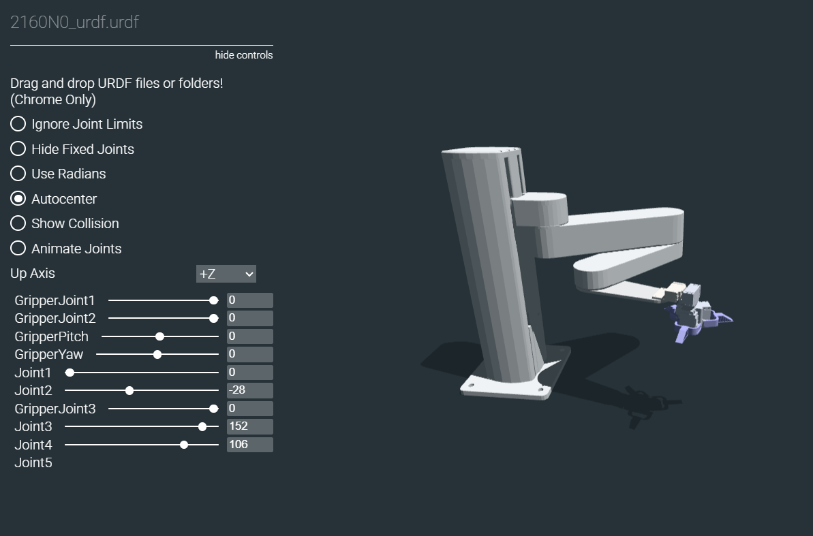

# Robotic Arm URDF Model

This repository contains the **URDF (Unified Robot Description Format)** model for a multi-DOF robotic arm with a parallel gripper. The model is intended for visualization, simulation, and integration with robotics frameworks such as **ROS**, **ROS 2**, and web-based URDF viewers.

## Robot Overview

* Multi-joint articulated arm
* End-effector with gripper
* Individual control of:

  * Arm joints
  * Gripper fingers
  * Gripper pitch and yaw
* Designed with clear joint limits and collision geometry

The model supports interactive joint manipulation and visualization, as shown in the image below.

### Example Output

Below is an example visualization of the urdf using https://gkjohnson.github.io/urdf-loaders/javascript/example/bundle/:

---
